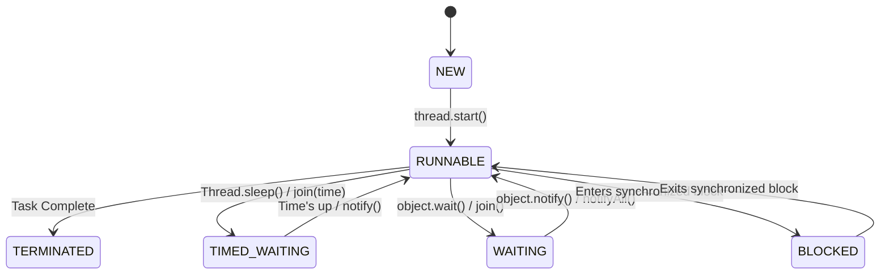

# 3. Thread Lifecycle - Mana Worker Status Enti? (What's Our Worker's Status?) 🚦

Mawa, welcome to Chapter 3! Last chapter lo manam worker threads ni ela create cheyalo nerchukunnam. Manam manager laaga, oka kotha worker ni hire chesi, vaadiki `start()` ani cheppi pani modalupettam.

But wait... `start()` cheppaka, aa worker em chestunnadu? Is he working? Is he taking a break? Has he finished?

## The Problem: The Mystery of the Worker's Status 🤔

Imagine nuvvu oka restaurant manager vi. Nuvvu oka waiter (thread) ni pani lo pettukunnav.
-   Shift start chesada? (Did the thread start?)
-   Kitchen door daggara aagipoyada? (Is the thread blocked?)
-   Customer order kosam wait chestunnada? (Is the thread waiting?)
-   Shift aipoinda? (Is the thread finished?)

Ee status teliyakapothe chala confusion vastundi. For example, shift aipoina waiter ni nuvvu malli pani cheyamani cheppalevu (`.start()` cannot be called twice). Status telekapovadam valla manam threads ni correct ga manage cheyalem, and idi chala bugs ki daari teestundi.

## The Solution: The Thread Lifecycle ✅

Luckily, Java manaki prathi thread yokka status ni cheptundi. Oka thread puttina daggara nunchi chanipoye varaku, adi konni states (dashalu) lo untundi. Deene **Thread Lifecycle** antaru.

Let's understand this with our new analogy: a **Restaurant Waiter 👨‍🍳**.

Let's look at each state through our waiter's workday.

---

### The 6 States of a Thread

1.  **`NEW`**: The "Shift Not Started" State 📋
    -   **Waiter Analogy**: The waiter has been hired. He has his uniform (`Runnable task`) and is on the schedule. But his shift hasn't started yet. He's waiting for the manager's signal.
    -   **Java World**: You have created a `Thread` object, but you haven't called the `.start()` method yet. `Thread waiter = new Thread(task);` - ippudu `waiter` thread `NEW` state lo unnadu.

2.  **`RUNNABLE`**: The "On the Floor" State 🏃‍♂️
    -   **Waiter Analogy**: The manager tells the waiter to start his shift. The waiter is now "on the floor." He is either actively taking an order or walking around, ready for the next customer. He is available to work.
    -   **Java World**: You've called `.start()`. The thread is now managed by the JVM's scheduler. It might be running, or it might be waiting for its turn on the CPU. **Important:** `RUNNABLE` ante running ani kaadu, it means *ready to run*.

3.  **`BLOCKED`**: The "Waiting for the Door" State 🚪
    -   **Waiter Analogy**: The waiter needs to enter the kitchen, but it has a single, busy, swinging door. Another waiter is currently coming out. Our waiter is blocked and must wait for the door to be free.
    -   **Java World**: The thread is trying to enter a `synchronized` block, but another thread already holds the lock for that object. Mana thread aa lock release ayyevaraku `BLOCKED` state lo untundi. (Ee `synchronized` gurinchi manam Chapter 6 lo chala detail ga chuddam).

4.  **`WAITING`**: The "Waiting for the Chef" State 🍽️
    -   **Waiter Analogy**: The waiter has given an order to the chef. Now he stands at the kitchen window, waiting for the chef to prepare the food and signal him. He will wait there indefinitely.
    -   **Java World**: The thread is waiting for another thread to perform a specific action. For example, calling `object.wait()` or another thread's `thread.join()`. It will wait indefinitely until it is notified by `object.notify()` or the other thread terminates.

5.  **`TIMED_WAITING`**: The "Waiting for the Customer" State 🕒
    -   **Waiter Analogy**: A customer says, "Give me 2 minutes to decide my order." The waiter will stand by the table for exactly 2 minutes before coming back.
    -   **Java World**: The thread is waiting for a specific amount of time. This happens when you call `Thread.sleep(milliseconds)`, `object.wait(timeout)`, or `thread.join(timeout)`.

6.  **`TERMINATED`**: The "Shift Over" State 🏁
    -   **Waiter Analogy**: The waiter's shift is over. He has clocked out and gone home. His work for the day is done. You can't ask him to take another order.
    -   **Java World**: The thread has finished executing its `run()` method. It's dead. You cannot restart a terminated thread. If you try, you'll get an `IllegalThreadStateException`.

---

## Why Should I Care? (Naaku Enduku Idi?)

Understanding the lifecycle is super important for debugging.
-   Mee application slow ga unda? Maybe chala threads `BLOCKED` or `WAITING` state lo unnayi.
-   Oka pani asalu avvatleda? Maybe aa thread `TERMINATED` aipoindi, and nuvvu daanni malli start cheyadaniki try chestunnav.

Tools like `jstack` or VisualVM allow you to take a "thread dump," which shows the state of every single thread. Ee knowledge tho, nuvvu aa output ni chusi, "Oh! Ee thread `BLOCKED` state lo undi, so there must be a lock issue!" ani easy ga cheppeyochu.

## What's Next? (తదుపరి ఏమిటి?)

Super, mawa! Ippudu manaki worker states gurinchi telusu. Kani, manam create chese threads lo rendu rakalu untayi: normal workers and... "personal assistant" workers. Ee assistants manam pani chestunnapudu help chestaru, manam aapesthe వాళ్ళు kuda aapestaru.

These are called **Daemon Threads**. What are they, and why are they important? Let's find out in the next chapter: **`04_Daemon_Threads`**. See you there! 👋
