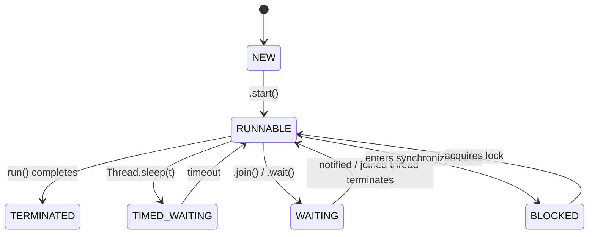

# 3. Thread Lifecycle - Mana Worker Status Enti? (What's Our Worker's Status?) 🚦

Mawa, welcome to Chapter 3! Last chapter lo manam worker threads ni ela create cheyalo nerchukunnam. Manam manager laaga, oka kotha worker ni hire chesi, vaadiki `start()` ani cheppi pani modalupettam.

This is a supportive chapter, not a problem-driven one. It's about understanding the "states" of a thread.

## The Problem: The Mystery of the Worker's Status 🤔

You've called `worker.start()`. Now what?
-   Is it running?
-   Is it waiting for something?
-   Is it finished?
-   Can I start it again?

If we don't know the status of our threads, managing them becomes impossible, and this leads to subtle bugs. For example, calling `.start()` on a thread that has already finished will cause an `IllegalThreadStateException`.

## The Solution: The Formal Thread Lifecycle

To solve this uncertainty, Java defines a formal **Thread Lifecycle**. A thread can only be in one of these states at any given time. Understanding these states is crucial for debugging.

**The Analogy: The Restaurant Waiter's Workday 👨‍🍳**
Let's use our waiter analogy to understand the states.

---

### The 6 States of a Thread (`Thread.State` enum)

1.  **`NEW`**: The "Shift Not Started" State 📋
    -   **Waiter Analogy**: The waiter has been hired but hasn't started their shift. They are waiting for the manager's signal.
    -   **Java World**: You have created a `Thread` object, but haven't called `.start()` yet.

2.  **`RUNNABLE`**: The "On the Floor" State 🏃‍♂️
    -   **Waiter Analogy**: The manager tells the waiter to start. The waiter is now "on the floor," either actively serving a table or ready to take the next one.
    -   **Java World**: The `.start()` method has been called. The thread is now eligible to be run by the OS scheduler. It might be currently running on a CPU, or it might be waiting its turn. From the JVM's perspective, it's ready to go.

3.  **`BLOCKED`**: The "Waiting for the Door" State 🚪
    -   **Waiter Analogy**: The waiter needs to enter the busy kitchen, which has a single swinging door (`synchronized` lock). Another waiter is currently using it. Our waiter is blocked at the door until it's free.
    -   **Java World**: The thread tried to enter a `synchronized` block, but another thread already holds the lock. The thread is blocked, waiting *only* for that specific lock to be released.

4.  **`WAITING`**: The "Waiting for the Chef" State 🍽️
    -   **Waiter Analogy**: The waiter has given an order to the chef and is now waiting indefinitely at the counter for the chef to signal that the food is ready (`notify()`).
    -   **Java World**: The thread is in an indefinite wait for some other thread to perform a particular action. This is caused by calling `object.wait()`, `thread.join()`, or `LockSupport.park()`. It's not waiting for a CPU or a lock; it's waiting for a specific signal.

5.  **`TIMED_WAITING`**: The "Waiting for the Customer" State 🕒
    -   **Waiter Analogy**: A customer says, "Give me 2 minutes to decide." The waiter will wait at the table for exactly 2 minutes before doing something else.
    -   **Java World**: The thread is waiting, but only for a specified amount of time. This is caused by calling `Thread.sleep(time)`, `object.wait(time)`, `thread.join(time)`, etc. After the timeout, it will return to the `RUNNABLE` state.

6.  **`TERMINATED`**: The "Shift Over" State 🏁
    -   **Waiter Analogy**: The waiter's shift is over. He has gone home. His work is done. You can't ask him to take another order.
    -   **Java World**: The thread has finished executing its `run()` method. It's dead. It cannot be restarted.

## The New Problem: What about "Helper" Threads?

Okay, so we have our main worker threads. But what about background "helper" threads?
*   A thread that periodically checks for health status.
*   A thread that performs garbage collection.
*   A thread that auto-saves a document every 30 seconds.

What should happen to these threads when our main application work is done? Should the application wait for the auto-save thread to finish its `sleep()`? That doesn't seem right. We need a way to distinguish between essential workers and non-essential assistants.

## What's Next?

This leads us to the concept of **Daemon Threads**. These are the "personal assistant" threads that don't prevent the application from shutting down. And that's our next chapter: **`04_Daemon_Threads`**. See you there! 🚀
