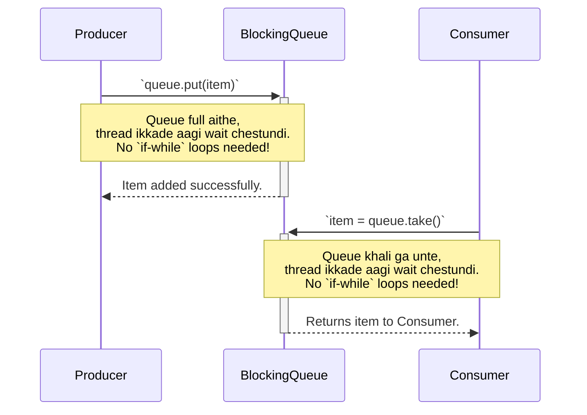

# Stage 3.3: Concurrency Design Patterns - Ready-made Solutions for Common Problems

Manam ippativaraku chala building blocks (`synchronized`, `Lock`, `CompletableFuture`) nerchukunnam. Kani, oka pedda illu kattalante, కేవలం bricks unte saripodu, daaniki oka "blueprint" or "design" kavali.

Concurrency lo kuda, konni problems malli malli vastune untayi. Prathi sari manam kotha ga logic rayakunda, ee problems ni solve cheyadaniki community andaru kalisi konni "Design Patterns" ni create chesaru. Eevi battle-tested, ready-made blueprints anamata.

Ee lesson lo, manam konni most important patterns chuddam.

---

### 1. Producer-Consumer Pattern (The Easy Way)

*   **Recap:** Oka thread produce chestundi, inko thread consume chestundi. Manam deeniki `wait/notify` tho code rasam. Adi chala complex ga undi kada?
*   **The Better Solution: `BlockingQueue`**
    *   Java `java.util.concurrent` package lo `BlockingQueue` ane oka wonderful interface ichindi.
    *   Idi oka special queue. Deeni magic entante, adi thread coordination ni automatically handle chestundi!
        *   `put(item)`: Queue lo item ni peduthundi. Okavela queue nindi unte (full), ee method thread ni **automatically wait** cheyistundi.
        *   `take()`: Queue nunchi item ni teeskuntundi. Okavela queue khali ga unte, ee method thread ni **automatically wait** cheyistundi.
    *   Manam inka `synchronized`, `wait`, `notify` lanti godava antha marchipovachu. Code chala simple and clean ga aipothundi.

Ee diagram chuste, `BlockingQueue` entha simple ga pani chestundo ardham avuthundi:



---

### 2. Reader-Writer Lock Pattern

*   **The Problem:** Manaki oka shared resource undi. Daanini chala threads okesari **read** cheyali, kani konni threads matrame appudappudu **write** cheyali.
    *   Example: Oka website lo unna product price. Vanda mandi okesari chudochu (read), kani admin okkare appudappudu daanini update chestaru (write).
*   `synchronized` or `ReentrantLock` vadithe emavuthundi? Okate lock undatam valla, oka thread read chestunna, inko thread read cheyaleka wait cheyali. Idi performance ni taggistundi.
*   **The Solution: `ReadWriteLock`**
    *   Ee lock manaki rendu different locks istundi: a **Read Lock** and a **Write Lock**.
    *   **Rules:**
        1.  Enni threads aina okesari **Read Lock** ni teeskuni, data ni parallel ga chadavochu.
        2.  Okate sari okka thread matrame **Write Lock** ni teeskogaladu.
        3.  Oka thread daggara Write Lock unnapudu, vere evaru (readers or writers) lopaliki raleru.
        4.  Oka thread daggara Read Lock unnapudu, vere writers lopaliki raleru, kani vere readers ravachu.

Ee diagram tho ee pattern ni chudochu:

```mermaid
graph TD
    Data[("Shared<br/>Configuration")]

    subgraph "Read-Heavy Scenario"
        R1[Reader 1] -- "Acquires readLock.lock()" --> Data
        R2[Reader 2] -- "Acquires readLock.lock()" --> Data
        R3[Reader 3] -- "Acquires readLock.lock()" --> Data
        label: "Multiple readers can access at the same time."
    end

    subgraph "Exclusive Write Scenario"
        W1[Writer 1] -- "Acquires writeLock.lock()" --> Data
        R4[Reader 4] -- "Blocked" --> W1
        W2[Writer 2] -- "Blocked" --> W1
        label: "When a writer has the lock, everyone else waits."
    end
```

---

### 🚨 When to Use These Patterns? (Trade-offs)

| Pattern | When to Use | When to Avoid |
| :--- | :--- | :--- |
| **Producer-Consumer with `BlockingQueue`** | Tasks ni decouple cheyadaniki. Oka thread pani generate chesi, inko thread daanini process cheyali anukunnappudu. Event processing systems lo common ga vadutaru. | Simple task passing avasaram lenappudu. Direct method calls better ga unte. |
| **Reader-Writer Lock** | **Read-heavy scenarios.** Read operations anevi write operations kanna chala ekkuva (Ex: 90% reads, 10% writes). Caching systems, configuration managers lanti chota perfect. | **Write-heavy scenarios** or when read/write ratio is almost equal (50-50). Ee situation lo, normal `ReentrantLock` performance eh better ga undochu. |

---

### Cliffhanger... The Ultimate Collections for Concurrency

Manam ippudu patterns nerchukunnam. `BlockingQueue` anedi `java.util.concurrent` package lo unna oka collection. Kani, ilantivi inka chala unnayi!

*   `HashMap` ni multiple threads tho vadithe emavuthundi? `ConcurrentModificationException` or infinite loops ravochu! Mari thread-safe `HashMap` edaina unda?
*   Oka `ArrayList` undi, daanini chala threads read chestayi, kani chala takkuva sarlu modify chestayi. Deeniki `ReadWriteLock` rayala, leda inka easy solution edaina unda?

Ee prashnalaki samadhanam, Java manaki ichina special **Concurrent Collections**. Get ready for the final topic of Stage 3, where we explore `ConcurrentHashMap`, `CopyOnWriteArrayList`, and more!
