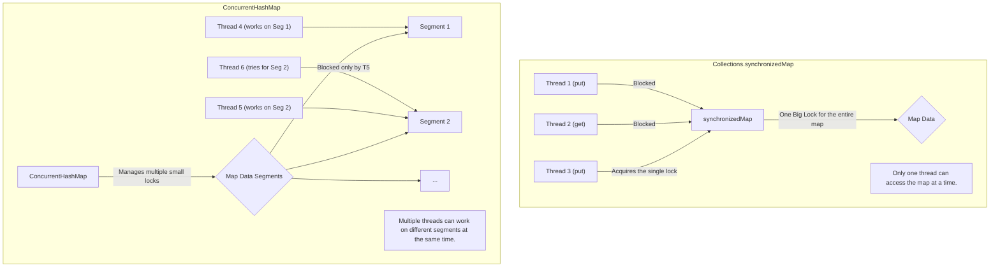

# Stage 3.4: Concurrent Collections - Thread-Safe Data Structures

Manam ippativaraku locking gurinchi chala nerchukunnam. Kani prathi sari `HashMap` or `ArrayList` vadinappudu, maname manual ga `synchronized` or `Lock` petti kapadukovali ante adi chala pani. Inka, thappulu jaragadaniki chala chance undi.

Ee kashtanni tappinchadanike, `java.util.concurrent` package manaki konni ready-made, thread-safe collections ni istundi. Veetini vadithe, manam locking gurinchi peddaga alochinchalsina pani ledu.

---

### The Problem with Standard Collections

*   `HashMap`, `ArrayList` lanti non-synchronized collections ni multiple threads tho (oka thread write chestu) vadithe, data corrupt avuthundi. `ConcurrentModificationException` ravochu, or even worse, infinite loops lo ki vellipovachu!
*   **Sare, `Collections.synchronizedMap(new HashMap<>())` vadavachu kada?** Yes, vadavachu. Kani adi mottham map ki okate pedda lock (coarse-grained lock) vaduthundi. Oka thread map lo oka entry ni read chestunna, inko thread vere entry ni read cheyaleka wait cheyali. Performance chala debba tintundi.

---

### 1. `ConcurrentHashMap` - The High-Performance Map

*   Idi `HashMap` ki thread-safe alternative. Kani, `synchronizedMap` kanna chala chala better.
*   **How it works (Internal Magic):** Idi mottham map ki okate lock veyadaniki badulu, daanini chala chinna chinna "segments" or "nodes" ga divide chesi, prathi segment ki oka separate lock peduthundi. Deenine **lock striping** antaru.
*   **Result:** Okate sari, multiple threads different segments meeda pani cheyochu. For example, Thread-1 segment-1 lo unna key ni update chestunte, Thread-2 segment-10 lo unna key ni read cheyochu. Iddaru okarini okaru block cheskoru. Concurrency chala ekkuva!

Ee diagram chuste aa theda meeku clear ga telustundi:

---

### 2. `CopyOnWriteArrayList` - The Read-Heavy Champion

*   Idi `ArrayList` ki thread-safe alternative, kani oka vinta strategy vaduthundi.
*   **How it works (Copy-on-Write):**
    *   **Read Operations:** Read operations ki asalu lock eh undadu! Enni threads aina okesari, entha veganga aina data ni chadavochu.
    *   **Write Operations (`add`, `remove`):** Oka thread write cheyadaniki try chesinappudu, adi original array ni touch cheyadu. Daaniki badulu, adi mottham array ni **copy** chesi, aa kotha copy meeda change chesi, final ga aa kotha copy ni point chestundi. Ee antha process oka lock tho jarugutundi.
*   **Result:** Writes anevi chala costly, endukante prathi sari mottham array copy avuthundi. Kani reads anevi chala chala fast, endukante asalu lock eh ledu.

---

### 🚨 Trade-offs and System Design Choices 🚨

| Collection | When to Use (Best Case) | When to Avoid (Worst Case) |
| :--- | :--- | :--- |
| **`ConcurrentHashMap`** | **General purpose, high-throughput cache.** Read and write operations ekkuva ga unna chota. Idi `synchronizedMap` ki default replacement. | Chala chinna maps ki, or contention asalu leni chota. Appudu normal `HashMap` eh better. |
| **`CopyOnWriteArrayList`** | **Read-dominant scenarios.** Oka list ni create chesaka, daanini chala ekkuva sarlu read chesi, chala takkuva sarlu (appudappudu) matrame modify chese chota. Example: Listeners list, configuration values list. | **Write-heavy scenarios.** Prathi sari list ni modify chestunte, performance antha debba tintundi ante assalu vadakudadu. Prathi write ki array copy avvadam valla memory usage kuda ekkuva. |
| **`BlockingQueue`** | **Producer-Consumer pattern.** Tasks ni oka thread nunchi inko thread ki safe ga pass cheyadaniki. | Normal queue la vadali anukunte. Deeni main purpose thread coordination, simple storage kaadu. |

---

### Stage 3 Summary - The Advanced Arsenal

Ee stage lo, manam modern concurrency yokka most advanced topics ni cover chesam.
1.  **Parallelism** (`Fork/Join`, `Parallel Streams`) tho CPU-bound tasks ni vegamga ela cheyalo chusam.
2.  **Virtual Threads** tho I/O-bound applications ni lakshalakoddi requests tho ela scale cheyalo nerchukunnam.
3.  **`CompletableFuture`** tho complex asynchronous pipelines ni elegant ga ela build cheyalo ardham cheskunnam.
4.  Ippudu, **Concurrency Patterns** and **Concurrent Collections** tho common problems ki ready-made, high-performance solutions ela vadalo telusukunnam.

Ippudu meeku modern, high-performance, scalable concurrent applications ni design chese knowledge undi.

---

### Cliffhanger... The Final Frontier: Performance, Debugging & a Look into the Future

Manam ippativaraku chala nerchukunnam. Kani, oka production system lo, code "work avvadam" matrame kaadu, adi "fast ga work avvadam" kuda important.
*   Mana code lo performance bottlenecks ekkada unnayo ela kanukkuntam?
*   Deadlocks ni live system lo ela detect cheyali?
*   Threads madhya unna "false sharing" lanti subtle performance killers gurinchi telusa?

Ee prashnalaki samadhanam kosam, manam mana final stage loki enter avabothunnam: **Stage 4 – Expert (Performance, Debugging & Cutting-Edge)**. Get ready to become a true concurrency expert!
