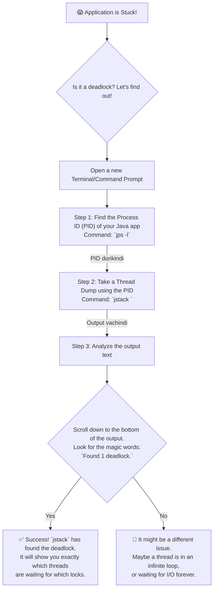

# Stage 4.2: Testing & Debugging - The Concurrency Detective

Manam entha jagrathaga code rasina, konni sarlu concurrency bugs tappavu. Vaatilo antha kanna bhayankaramainadi **Deadlock**. Oka deadlock vachinappudu, mee application antha aagipothundi, respond avvadu.

Ee lesson lo, manam oka concurrency detective la alochinchi, ee lanti deadlocks ni ela pattukovalo (diagnose) and solve cheyalo nerchukuntam.

---

### What is a Deadlock? - Iddaru Monda Pattu!

*   Deadlock anedi oka special situation, ekkada rendu or ekkuva threads okari kosam okaru anantham ga wait chestu undipotaru.
*   **Simple Analogy:**
    *   Thread-A daggara `Lock-1` undi, daaniki `Lock-2` kavali.
    *   Thread-B daggara `Lock-2` undi, daaniki `Lock-1` kavali.
    *   Iddaru "nuvvu isthe nenu istha" ani mondi pattu pattukuni kurchunnaru. Iddaru eppatiki munduku vellaru. Application stuck!

*   **Four Conditions for Deadlock (Interview Question!):** Oka deadlock ravadaniki, ee 4 conditions okesari jaragali.
    1.  **Mutual Exclusion:** Resource (like a lock) ni okate sari okkare teeskogalaru.
    2.  **Hold and Wait:** Oka thread, oka resource ni pattukuni, inko resource kosam wait chestondi.
    3.  **No Preemption:** Oka thread daggara unna resource ni daani ishtam lekunda vere vallu laagukoleru.
    4.  **Circular Wait:** Thread-A waits for Thread-B, Thread-B waits for Thread-C, ..., and Thread-N waits for Thread-A. Oka cycle form avuthundi.

---

### How to Find a Deadlock? - Using Thread Dumps

Oka running Java application stuck ayinappudu, daani lona threads em chestunnayo, evari kosam wait chestunnayo teluskovadaniki manam **Thread Dump** teestam. Idi oka snapshot anamata. Deeniki `jstack` ane powerful command-line tool vadatham.

Ee flowchart, debugging process ni step-by-step ga chupistundi:



### Analyzing the `jstack` Output

`jstack` output lo deadlock unte, adi chala clear ga chupistundi. Adi ila untundi:
```
Found a total of 1 deadlock.
=============================

"Thread-B":
  waiting to lock monitor 0x00007f9b5c003e08 (object 0x00000007cbe07e78, a java.lang.Object),
  which is held by "Thread-A"

"Thread-A":
  waiting to lock monitor 0x00007f9b5c005218 (object 0x00000007cbe07e88, a java.lang.Object),
  which is held by "Thread-B"
```
Ee output chusi, manam "Oh, Thread-A anedi Thread-B daggara unna lock kosam, Thread-B anedi Thread-A daggara unna lock kosam wait chestunnayi" ani easy ga ardham cheskovachu.

Solution entante, threads anni locks ni okate order lo teeskunela code ni marchali.

Mana `DeadlockExample.java` file ni run chesi, ee steps ni meeru practice cheyochu!

---

### Cliffhanger... Inka Enni Rakala Problems Unnayi?

Deadlock anedi famous villain, kani concurrency prapancham lo inka chala mandi villains unnaru!
*   **Livelock:** Iddaru threads okarini okaru respond avuthu, panulu matram cheyakunda undipovadam. (Ex: Iddaru corridor lo okariki okaru daari isthu, eppatiki munduku vellakapovadam).
*   **Starvation:** Oka thread ki eppatiki CPU time dorakkapovadam.
*   **Double-Checked Locking Anti-Pattern:** Singleton pattern ni implement chesetappudu chala mandi chese oka common thappu.

Ee common mistakes and anti-patterns gurinchi teluskovadam valla, manam inka better, robust code rayagalam. Ade mana next topic: **Common Pitfalls & Anti-Patterns**.
