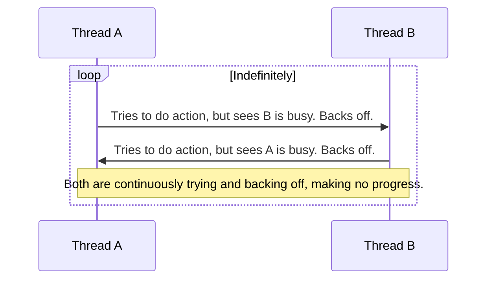

# Stage 4.3: Common Pitfalls & Anti-Patterns - Thappulu Jaragakunda Chuskovadam

Manam ippativaraku "ela cheyali" ani nerchukunnam. Kani, oka expert ki "ela cheyakudadu" ani kuda teliyali. Concurrency lo, konni common thappulu (pitfalls) and chedda design choices (anti-patterns) untayi. Vaati gurinchi teluskovadam valla, manam chala bugs ni mundugane avoid cheyochu.

---

### 1. Deadlock - The Ultimate Stalemate

*   **Recap:** Rendu or ekkuva threads okari daggara unna lock kosam inkokaru wait chestu, forever stuck aipovadam. Manam deeni gurinchi mundu topic lo ne chusam.
*   **How to Avoid:** Eppudu locks ni okate fixed order lo teeskondi.

---

### 2. Livelock - Pani Avvadu, Kani Busy ga Untaru

*   **Concept:** Livelock anedi deadlock laantide, kani ikkada threads 'stuck' avvavu, 'active' ga untayi. Kani, vaalla pani matram munduku saagadu.
*   **Analogy:** Iddaru manushulu oka darilo eduru paddaru anukondi.
    *   Person A pakkaki jarugutadu. Person B kuda ade samayaniki, ade pakkaki jarugutadu.
    *   "Sorry," anukuni, iddaroo malli vere pakkaki jarugutaru. Malli block!
    *   Veellu eppatiki respond avutune untaru, kani evaru munduku vellaleru.
*   Threads kuda ilage, okari action ki inkokaru respond avutuu, useful work cheyakunda undipothe, daanini Livelock antaru.



---

### 3. Starvation - Eppudu Naa Chance Vastundi?

*   **Concept:** Oka thread ki eppatiki CPU time or lock dorakkapovadam. Adi tana pani cheyadaniki chance kosam "starve" (aakalito undatam) chestu untundi.
*   **When it happens?**
    *   Threads ki different priorities unnapudu, high-priority threads eppudu run avutunte, low-priority thread ki chance rakapovachu.
    *   `synchronized` lanti non-fair locks vadinappudu, oka "greedy" thread malli malli lock teeskuntu, vere thread ki chance ivvakapovachu.

```mermaid
block-diagram
    block:CPU["CPU Time (Resource)"]

    block:Threads
        block:T1["High-Priority Thread 1"]
        block:T2["High-Priority Thread 2"]
        block:T3["Low-Priority Thread 3"]
    end

    edge:T1 -- "Gets CPU Time" --> CPU
    edge:T2 -- "Gets CPU Time" --> CPU
    edge:T3 -.-> CPU
    note over T3: "Paapam! Naaku eppudu chance vastundo..."
```

---

### 4. The Double-Checked Locking (DCL) Anti-Pattern

*   Idi antha kanna famous and most asked interview question. Idi Singleton Pattern ni thread-safe ga and lazily create cheyadaniki try chese oka technique.
*   **The Flawed Logic (Old Days):**
    ```java
    // DO NOT USE THIS CODE! IT IS BROKEN!
    class Singleton {
        private static Singleton instance;

        public static Singleton getInstance() {
            if (instance == null) { // 1st Check (without lock)
                synchronized(Singleton.class) {
                    if (instance == null) { // 2nd Check (with lock)
                        instance = new Singleton(); // BUG IS HERE!
                    }
                }
            }
            return instance;
        }
    }
    ```
*   **Why is it Broken (before Java 5)?**
    *   Problem antha `instance = new Singleton();` ane line lo undi. Manaki adi okate step la kanipinchina, JVM daanini 3 steps ga cheyochu:
        1.  Allocate memory for the `Singleton` object.
        2.  Call the `Singleton` constructor to initialize the fields.
        3.  Assign the memory address to the `instance` variable.
    *   Kani, JVM performance kosam ee steps ni **reorder** cheyochu. Ante, 1 -> 3 -> 2 sequence lo cheyochu!
    *   **The Disaster:**
        1.  Thread-A lopaliki vachi, memory allocate chesi (Step 1), daanini `instance` ki assign chestundi (Step 3). Kani, inka constructor run avvaledu! `instance` anedi not-null, kani adi inka fully-constructed object kaadu.
        2.  Ee time lo, Thread-B vachi, modati `if (instance == null)` check chestundi. `instance` not-null kabatti, adi `false` ayyi, aa half-baked, partially constructed object ni return chesestundi! CRASH!
*   **The Solution:**
    1.  Java 5 tarvata, `instance` variable ni `volatile` ga declare cheste (`private volatile static Singleton instance;`), ee problem solve avuthundi. `volatile` anedi reordering ni aapesthundi.
    2.  **But the REAL solution is to not use DCL at all!** Deeni kanna chala simple and safe ways unnayi.

*   **The Best Way (Initialization-on-demand holder idiom):**
    ```java
    class Singleton {
        private Singleton() {}

        private static class SingletonHolder {
            private static final Singleton INSTANCE = new Singleton();
        }

        public static Singleton getInstance() {
            return SingletonHolder.INSTANCE;
        }
    }
    ```
    Ee approach lazy, thread-safe, and chala simple. JVM ee class loading mechanism ni internally handle chestundi. Interviews lo DCL gurinchi adiginappudu, ee better solution gurinchi chepthe, meeku full respect istaru.

---

### Cliffhanger... The Journey's End

Manam ippudu expert-level concepts, common thappulu anni chusam. Inka okate okka topic migilindi. Java anedi eppudu evolve avutune untundi. Java 21, 22, 23... kotha versions vastune unnayi. Concurrency lo kuda kotha features add avutune unnayi.

Mana final topic lo, manam ee **Latest Java Features & Trends** gurinchi matladukuni, mee knowledge eppudu up-to-date ga undela chuskundam. Let's finish strong!
