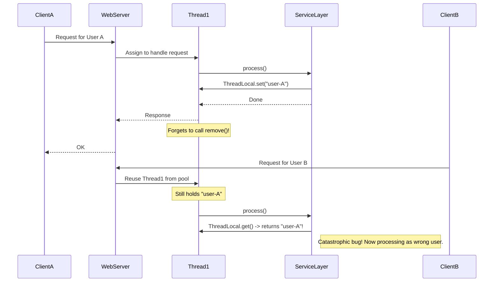

# Module 15: Scoped Values 🎯

## 1. The Old Problem: `ThreadLocal` and its Dangers 😥

Imagine you have a web request. For this single request, you need to pass around some context, like the `UserID` or a `TransactionID`. You need this information in the controller, the service layer, and the data access layer.

How do you pass this data without adding it as a parameter to every single method in your call stack? (`doSomething(..., userID, transactionID)`)

**The Historical Solution: `ThreadLocal`**

For years, the answer was `ThreadLocal`. It's like a secret, hidden map where the key is the current thread.

`ThreadLocal<String> userID = new ThreadLocal<>();`
`userID.set("user-123");`

Now, any method running on this specific thread can call `userID.get()` and retrieve "user-123" without it being passed as a parameter. It felt like magic!

**But a New, Dangerous Problem Emerged: The Leaks and Corruption 💥**

This "magic" came at a huge cost, especially in modern applications that use thread pools.

*   **Problem 1: Data Leaks & Corruption:** In a thread pool, threads are recycled. A request comes in, uses Thread-1, and sets `userID.set("user-A")`. The request finishes, but the developer *forgets* to call `userID.remove()`. Now, Thread-1 is returned to the pool with "user-A" still inside it. The next request comes in, gets assigned Thread-1, and now it's incorrectly operating as "user-A"! This is a massive security risk and a source of silent, horrible bugs.

*   **Problem 2: Memory Leaks with Virtual Threads:** `ThreadLocal` was designed when threads were scarce. But with Virtual Threads (Module 13), you can have *millions* of them. If each of those millions of threads holds a `ThreadLocal` value, you could easily run out of memory. The data is stored for the entire lifetime of the thread, even if it's only needed for a small part of the operation.

*   **Problem 3: No Immutability:** `ThreadLocal` values are mutable. Any method at any point can change the value (`userID.set("new-user")`), making the data flow unpredictable and hard to debug. Who changed the user ID? When? It's a mystery.



## 2. The Modern Solution: Scoped Values (JEP 446) ✨

The Java architects realized that `ThreadLocal` was fundamentally flawed for modern, structured concurrent applications. They introduced **Scoped Values** as a robust, safe, and efficient replacement.

**The Core Idea:**
A Scoped Value allows you to share data with all code that is executed *within a specific scope*, without passing it as a method argument. Crucially, the data is **immutable** and its lifetime is **lexically scoped**.

```java
// 1. Define a Scoped Value. It's a static, final field.
public static final ScopedValue<String> USER_ID = ScopedValue.newInstance();

// 2. Bind the value for a specific scope of execution.
ScopedValue.where(USER_ID, "user-ABC")
           .run(() -> {
               // All code executed from here, including nested method calls
               // and in child threads, can read the value.
               myService.processRequest();
           });

// 3. After the 'run' method completes, the binding is automatically destroyed.
// USER_ID.isBound() will be false here. No leaks!
```

**How it Solves the `ThreadLocal` Problems:**

1.  **No More Leaks:** The data binding (`"user-ABC"`) only exists for the duration of the `run()` lambda. Once the block finishes, the binding is gone. It's impossible to "forget to remove" it. The lifetime is tied to the code's structure, not the thread's lifetime.

2.  **Immutability by Default:** Once a `ScopedValue` is bound, its value cannot be changed within that scope. This makes data flow predictable and eliminates a whole class of bugs. If you need a different value, you must create a new, nested scope.

3.  **Designed for Virtual Threads:** Scoped Values are highly efficient. When you use them with Structured Concurrency (Module 14), the value is automatically and cheaply inherited by all child threads (virtual or platform) forked within the scope. This avoids the memory explosion problem of `ThreadLocal` with millions of virtual threads.

```mermaid
graph TD
    A[Request Starts] --> B{ScopedValue.where(USER_ID, "user-ABC").run(...)}
    subgraph "Safe Scope"
        B --> C[myService.processRequest()];
        C --> D[myRepository.findData()];
        D --> E{USER_ID.get() -> "user-ABC"};
        subgraph "Child Thread (forked in scope)"
           F[task.run()] --> G{USER_ID.get() -> "user-ABC"}
        end
        C --> F
    end
    B --> H[Request Ends - Binding is GONE];
    style H fill:#9f9,stroke:#333,stroke-width:2px

    Note right of G: Value is inherited automatically!
    Note right of H: No chance of leaking data to the next request.
```

Scoped Values, when combined with Structured Concurrency and Virtual Threads, form the trifecta of modern Java concurrency. They provide a way to pass data that is safe, structured, and highly performant, finally solving the decades-old problems of `ThreadLocal`. 🚀🔒
