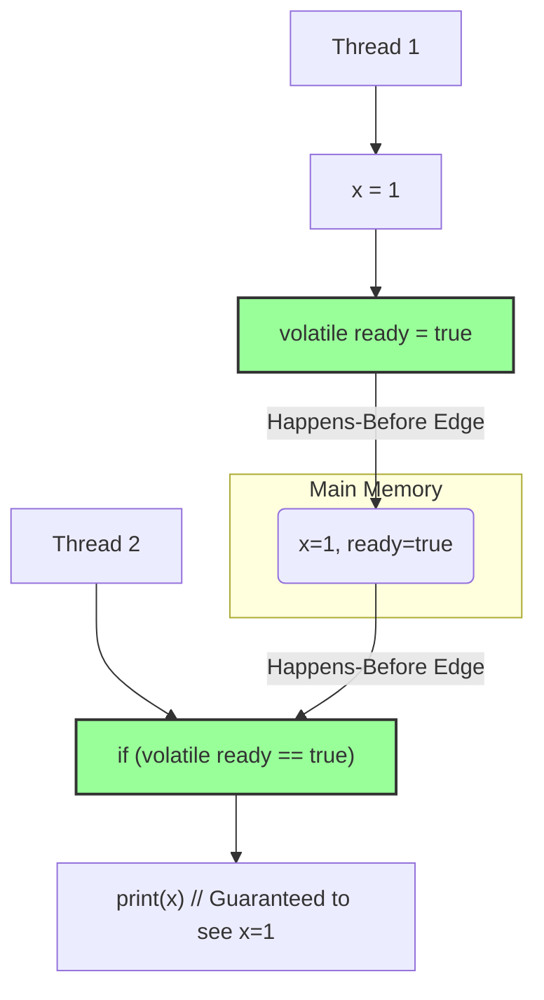

# Module 16: The Java Memory Model (JMM) 🧠

## 1. The Core Problem: Your Code is Not What it Seems 👻

Imagine you write this simple code:

```java
// Thread 1
x = 1;
ready = true;

// Thread 2
if (ready) {
    System.out.println(x);
}
```

You, the programmer, have a simple expectation: If Thread 2 prints something, it *must* print `1`. How could it be otherwise? Thread 1 sets `x` *before* it sets `ready`.

**The Historical Problem: Performance vs. Predictability**

This is where the reality of modern hardware and compilers hits. To make code run faster, CPUs and the Java JIT (Just-In-Time) compiler are allowed to perform aggressive optimizations.

1.  **Instruction Reordering:** The compiler or CPU might look at `x = 1; ready = true;` and decide they are independent. To be more efficient, it might reorder them! Thread 1 could actually execute `ready = true;` *before* `x = 1;`.
2.  **Caching:** Each CPU core has its own local cache, which is like a private notepad. When Thread 1 writes `x = 1`, it might only write it to its own cache. Thread 2, running on a different core, might have an old, stale value of `x = 0` in its cache and never see the update.

**The Result: Chaos.**
Because of these optimizations, Thread 2 could see `ready` as `true`, but `x` as `0`. Your program would print `0`, which seems impossible from the source code.

This is the fundamental problem the Java Memory Model (JMM) was created to solve. The JMM is a set of rules and guarantees that specifies when a write to a variable by one thread is guaranteed to be visible to another thread. It's a contract between the JVM and your code.

```mermaid
graph TD
    subgraph Core 1
        A[Thread 1] --> B{x = 1};
        A --> C{ready = true};
        B -.-> D[Cache 1: x=1, ready=true];
        C -.-> D;
    end
    subgraph Core 2
        E[Thread 2] --> F{if(ready)};
        F --> G{print(x)};
        H[Cache 2: x=0, ready=false] -.-> F;
    end

    I[Main Memory]
    D -- maybe later --> I
    I -- maybe later --> H

    style F fill:#f9f,stroke:#333,stroke-width:2px
    Note right of G: Without JMM guarantees, Thread 2 <br> might read `ready=true` from Main Memory <br> but still have a stale `x=0` in its local cache.
```

## 2. The First Solution: The `synchronized` Sledgehammer 🔨

The initial solution in Java was the `synchronized` keyword. It was designed to provide **mutual exclusion** (i.e., a lock to prevent two threads from entering a critical section at the same time).

However, `synchronized` also came with a powerful memory guarantee:

*   When a thread **exits** a `synchronized` block, it performs a "flush." It writes all of its changes from its local cache out to main memory.
*   When a thread **enters** a `synchronized` block, it performs an "invalidate." It clears its local cache, forcing it to read the latest values from main memory.

This creates a **"happens-before"** relationship. The exit of a synchronized block on a monitor *happens-before* any subsequent entry of a synchronized block on that *same monitor*.

**But a New Problem Emerged: It Was Too Heavy**

`synchronized` is a "sledgehammer." It provides both locking and memory visibility. What if you didn't need a lock? What if you just had one thread writing and multiple threads reading? Using `synchronized` was inefficient. The overhead of acquiring and releasing a lock was unnecessary if you only wanted the memory visibility guarantee.

## 3. The Evolved Solution: The `volatile` Scalpel 🔪

This led to the refinement of the `volatile` keyword. `volatile` is a much lighter-weight tool designed for exactly this scenario: you only need memory visibility, not mutual exclusion.

When you declare a variable as `volatile`, you get two critical guarantees:

1.  **Visibility:** Any write to a `volatile` variable is guaranteed to be flushed to main memory immediately. Any read of a `volatile` variable is guaranteed to read from main memory. The "stale cache" problem is solved for that variable.
2.  **No Reordering:** The compiler and CPU are forbidden from reordering instructions around a `volatile` variable.

If we change our original example:
`volatile boolean ready = false;`

Now, the JMM guarantees that the write to `x` *happens-before* the write to `volatile ready`. When Thread 2 reads `ready` as `true`, it is guaranteed to see the write to `x` as `1`. The bug is fixed.



## 4. The Modern Approach: High-Level Abstractions 🚀

While `volatile` is a powerful tool, it's still considered relatively low-level. It's easy to use incorrectly in complex scenarios (like compound actions: `i++`).

The modern, and safest, approach is to use the high-level concurrency utilities provided in the `java.util.concurrent` package, especially the **atomic classes**.

*   `AtomicInteger`, `AtomicLong`, `AtomicBoolean`, `AtomicReference`

These classes encapsulate the principles of the JMM inside safe, easy-to-use methods. For example, `AtomicInteger` provides methods like `incrementAndGet()` and `compareAndSet()`.

When you use `atomicInt.incrementAndGet()`, you are performing a read, a modify, and a write as a single, atomic operation. Internally, these classes use `volatile` semantics and low-level hardware instructions (like CAS - Compare-And-Swap) to ensure that these operations are thread-safe, visible, and performant.

**The Evolution Summary:**

*   **Problem:** Compiler/CPU optimizations cause visibility and ordering issues.
*   **Solution 1:** `synchronized` - Works, but is heavy and provides unnecessary locking.
*   **Solution 2:** `volatile` - Lighter weight, provides visibility and ordering, but is still low-level.
*   **Modern Solution:** `java.util.concurrent.atomic` classes - The preferred, high-level approach that abstracts away the complexity of the JMM, providing safe and performant tools for concurrent programming.

For most application developers today, you should reach for the atomic classes first, and only use `volatile` when you have a very specific, simple visibility requirement. Understanding the JMM is crucial to know *why* these tools are necessary. ✨🔒
