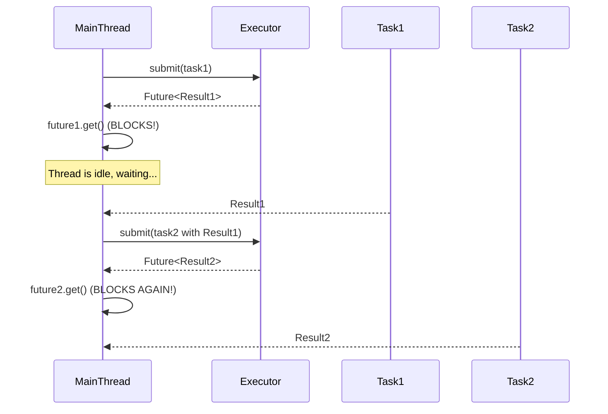

# Module 19: CompletableFuture 异步编排

## 1. The Old Problem: `Future` was a Dead End Street 😒

In Java 5, we got `Future`. It was a promise of a result from an asynchronous computation. You could submit a `Callable` to an `ExecutorService` and get a `Future` back.

```java
Future<String> future = executor.submit(() -> someLongComputation());
// ... do other work ...
String result = future.get(); // Blocks until the result is ready
```

This was a step forward, but `Future` had severe limitations.

**The Historical Problem: Blocking and Lack of Composability**

1.  **It was Blocking:** The primary way to get the result was `future.get()`, which blocks the current thread until the computation is finished. This negated many of the benefits of asynchronous programming. Your supposedly non-blocking application would just have threads sitting around waiting.

2.  **No Real Exception Handling:** If the task threw an exception, it was wrapped in an `ExecutionException` and only thrown when you called `get()`. You had to handle it with a clunky `try-catch` block, far away from the task submission.

3.  **No Composability (The Biggest Problem):** This was the real killer. You couldn't chain operations together. You couldn't say: "When this `Future` completes, take its result and feed it into another asynchronous task." This led to two ugly patterns:
    *   **Nested Blocking:** `result1 = future1.get(); future2 = executor.submit(() -> process(result1)); result2 = future2.get();` This created a chain of blocking calls, defeating the purpose.
    *   **Callback Hell:** You could try to build your own callback system, but it would be complex, messy, and hard to reason about.

A `Future` was like a read-only promise. You couldn't do anything with it except wait for it to be fulfilled.


*This is synchronous execution disguised as asynchronous.*

## 2. The Modern Solution: `CompletableFuture` - Composable, Non-Blocking Chains ⛓️

Java 8 introduced `CompletableFuture`, a massive leap forward for asynchronous programming. It solves all the problems of the old `Future`.

A `CompletableFuture` is a `Future` that you can:
1.  **Complete Programmatically:** You can create a `CompletableFuture` and complete it with a value or an exception at any time.
2.  **Compose with Fluent Callbacks:** It has a rich, fluent API for creating pipelines of asynchronous operations without blocking.

**The Core Idea:** Instead of blocking and waiting for a result, you attach a callback that will be executed automatically when the result is ready.

```java
CompletableFuture.supplyAsync(() -> fetchUser("123")) // Stage 1: Fetch user
    .thenApply(user -> fetchOrders(user))          // Stage 2: When user is ready, fetch orders
    .thenApply(orders -> enrichOrders(orders))         // Stage 3: When orders are ready, enrich them
    .thenAccept(enrichedOrders -> display(enrichedOrders)) // Stage 4: When ready, display them
    .exceptionally(error -> {                          // Global error handling
        System.err.println("Something went wrong: " + error.getMessage());
        return null;
    });
```

**How it Solves the Problems:**

1.  **Non-Blocking:** The main thread that launches this chain is **not blocked**. It fires off the first task and moves on. The entire pipeline runs in the background, managed by an executor service.
2.  **Declarative Composition:** The `thenApply`, `thenAccept`, `thenCompose` methods allow you to build a clean, readable, and logical pipeline of dependent actions.
3.  **Built-in Exception Handling:** The `exceptionally()` and `handle()` methods allow you to define a clear error-handling strategy for the entire chain in one place.

```mermaid
graph TD
    A[supplyAsync(fetchUser)] -- Result: User --> B;
    subgraph "Non-Blocking Pipeline (Managed by Executor)"
      B(thenApply) -- Input: User --> C{fetchOrders};
      C -- Result: Orders --> D(thenApply);
      D -- Input: Orders --> E{enrichOrders};
      E -- Result: EnrichedOrders --> F(thenAccept);
      F -- Input: EnrichedOrders --> G{display};
    end
    A -- Exception --> H{exceptionally};
    C -- Exception --> H;
    E -- Exception --> H;

    style H fill:#f99,stroke:#333,stroke-width:2px
```
*Any failure at any stage flows directly to the single exception handler.*

## 3. Key `CompletableFuture` Patterns

*   **Creating Tasks:**
    *   `supplyAsync(Supplier<U>)`: For a task that returns a result.
    *   `runAsync(Runnable)`: For a task that doesn't return a result.
    *   **Pro Tip:** Always provide your own `Executor` for I/O-bound tasks (`supplyAsync(supplier, myExecutor)`) to avoid starving the default common `ForkJoinPool`.

*   **Chaining Tasks (one-to-one):**
    *   `thenApply(Function<T,U>)`: Transforms the result. Takes a T, returns a U.
    *   `thenAccept(Consumer<T>)`: Consumes the result. Takes a T, returns nothing. The end of a pipeline.
    *   `thenRun(Runnable)`: Runs an action after completion. Takes nothing, returns nothing.

*   **Combining Tasks (many-to-one):**
    *   `thenCombine(other, BiFunction<T,U,V>)`: Waits for **two** `CompletableFuture`s to complete, then combines their results.
    *   `allOf(cfs...)`: Waits for **all** provided `CompletableFuture`s to complete. Returns `CompletableFuture<Void>`.
    *   `anyOf(cfs...)`: Waits for the **first one** of the provided `CompletableFuture`s to complete.

`CompletableFuture` fundamentally changed asynchronous programming in Java, moving it from a clunky, blocking model to a fluid, non-blocking, and highly readable compositional style. It is the foundation of modern reactive programming in Java. 🌟异步编程的野兽！
