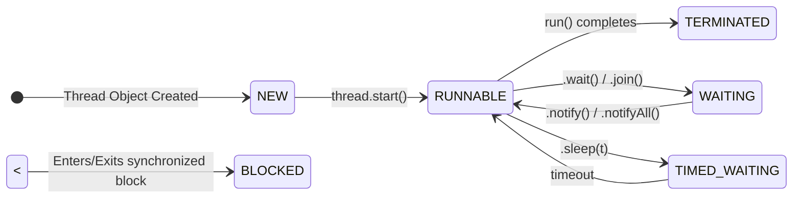

# Stage 1.1: Thread Fundamentals - Oka Pedda Story ki Idi Modalu!

Hello! Java Concurrency ane ee prayanamlo idi mana modati adugu. Don't worry, nenu simple ga chepta choodu. Manam concepts ni chinnaga, neat ga ardham cheskuntu munduku veldam.

---

### Asalu ee "Thread" ante enti? (What is a Thread?)

*   Simple ga cheppali ante, thread anedi oka chinna program (a light-weight sub-process).
*   Manam రాసే Java program antha `main` ane oka default thread lo run avuthundi.
*   Multiple threads use cheyadam valla, manam okate sari chala panulu (tasks) cheyagalam. Deenine **Multithreading** antaru.
*   Example: Okesari oka file download cheyadam, inko pakkana music vinadam, and inkoti type cheyadam. Ivanni separate threads lo jarugutunnay anamata!

---

### Java lo Threads ni ela Create cheyali? (How to create Threads in Java?)

Java lo threads create cheyadaniki manaki konni important ways unnayi. Let's see them one by one.

#### 1. `Runnable` Interface use chesi

Idi antha kanna best and most recommended way.
*   **Enduku?** Java lo manam multiple inheritance cheyalem, so `Thread` class ni extend cheste, inko class ni extend chese chance miss avutam. `Runnable` implement cheste aa problem undadu.
*   **Ela?** Oka class create chesi `Runnable` interface ni implement cheyali. Appudu, `run()` ane method ni override chesi, andulo mana task logic ni rayali.

```java
class MyTask implements Runnable {
    public void run() {
        System.out.println("Ee task oka kottha thread lo run avuthondi!");
    }
}
```

#### 2. `Thread` Class ni Extend chesi

*   **Ela?** Direct ga `Thread` class ni extend chesi, `run()` method ni override cheyochu.
*   **Enduku vadakudadu?** Munde cheppinattu, inheritance chance block aipotundi.

```java
class MyThread extends Thread {
    public void run() {
        System.out.println("Idi kuda kottha thread eh, kani vereలా create chesam.");
    }
}
```

#### 3. `Callable` Interface use chesi (Future tho kalisi)

*   **Idi enduku special?** `Runnable` lo `run()` method emi return cheyadu. Kani `Callable` lo `call()` method oka value ni return cheyagaladu! Inka, exception kuda throw cheyagaladu.
*   Deeni gurinchi manam `ExecutorService` topic lo inka deep ga nerchukuntam. Just gurtupettukondi.

---

### Thread Lifecycle - Oka Thread yokka Jeevitha Chakram

Prathi thread ki oka lifecycle untundi. Ante, adi puttinappati nunchi chanipoye varaku konni stages (states) lo untundi. Ee diagram chuste meeku clear ga ardham avuthundi.



*   **NEW:** `Thread thread = new Thread()` ani create chesinappudu, thread ee state lo untundi. Appude puttina pasipilla anamata.
*   **RUNNABLE:** `thread.start()` anagane, ee state ki vastundi. "Nenu run avvadaniki ready ga unna, CPU time ivvandi" ani adugutundi.
*   **WAITING/BLOCKED/TIMED_WAITING:** Thread run avvakunda temporary ga aagipothe ee states lo untundi.
    *   `sleep()` chesinappudu `TIMED_WAITING` lo untundi.
    *   Inko thread kosam `join()` or `wait()` chesinappudu `WAITING` lo untundi.
    *   `synchronized` lock kosam wait chestunte `BLOCKED` state lo untundi.
*   **TERMINATED:** `run()` method lo unna pani antha aipoyaka, thread ee state ki vachi chanipotundi.

---

### Daemon Threads - Veellu Special Endukante...

*   Java lo threads rendu rakalu: **User Threads** and **Daemon Threads**.
*   Manam create chesevi default ga User threads.
*   **Daemon threads** anevi background lo service tasks chese threads (Example: Garbage Collector).
*   **Main Point:** Program lo anni user threads aipothe, JVM (Java Virtual Machine) daemon threads kosam wait cheyadu, ventane program ni aapesthundi. Ante, user threads unnantha varake daemon threads brathukutayi.

---

### Cliffhanger... Oka Vinta Samasya!

Wow! Manam threads ni create cheyadam, vaati lifecycle gurinchi nerchukunnam. Antha bagane undi anukuntunara?

Kaani... oka vinta samasya undi. Oka thread chesina change (Ex: `isDataReady = true;` anadam), inko thread ki eppatiki kanapadakapovachu! Enduku ala? Threads okari maata okaru enduku vinaru? Ee "Memory aney maaya" gurinchi manam next topic lo chudబోతున్నాం: **The Java Memory Model**. Get ready!
