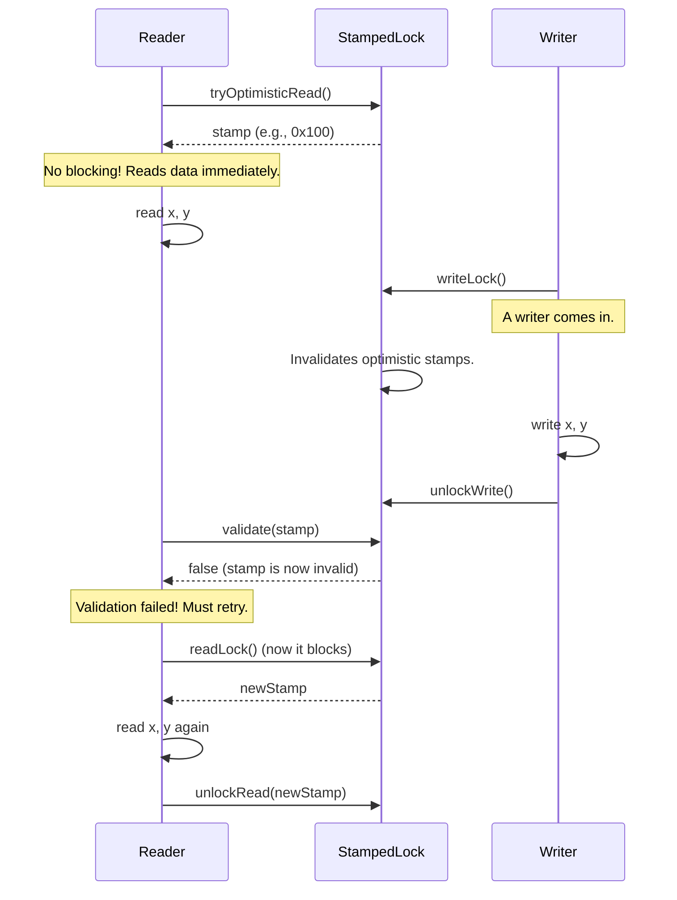

# Module 20: StampedLock 🎟️

## 1. The Old Problem: `ReentrantReadWriteLock` was Pessimistic and Limited

For read-heavy, write-infrequent scenarios, a simple `synchronized` block is inefficient because it blocks everyone even when multiple threads just want to read. `ReentrantReadWriteLock` (Module 10) was created to solve this by allowing multiple readers to enter the lock simultaneously, as long as there are no writers.

**The Historical Problem: The Read-Write Lock wasn't Perfect**

`ReentrantReadWriteLock` was a big step up, but it had its own set of problems:
1.  **It's Pessimistic:** Acquiring a read lock is still a "heavy" operation. It involves lock acquisition logic and memory synchronization, even if no writer is present. For very high-frequency reading, this overhead can add up.
2.  **Writer Starvation:** In many common implementations, if there is a constant stream of incoming read requests, they can continuously acquire the read lock and "starve" a waiting write request, preventing it from ever running.
3.  **No Lock Upgrading:** This was a major inflexibility. You **cannot** upgrade a read lock to a write lock. If a thread holding a read lock discovers it needs to write, it must first release its read lock and then try to acquire the write lock. In that tiny gap, another thread could sneak in and acquire the write lock, forcing the first thread to start all over.

## 2. The Modern Solution: `StampedLock` and Optimistic Reading 🚀

Java 8 introduced `StampedLock`, a new and highly sophisticated lock that addresses the limitations of `ReentrantReadWriteLock`. It's designed for extreme performance in read-heavy situations.

**The Core Idea: A Lock can be a "Stamp"**

Instead of `lock()` and `unlock()` methods, `StampedLock` methods return a `long` value called a **stamp**. This stamp is like a ticket that represents the state of the lock. You use this stamp to unlock it or to check its validity.

`StampedLock` provides three modes:

1.  **Writing (`writeLock()`):** An exclusive lock. No other readers or writers can enter. Returns a stamp to be used with `unlockWrite(stamp)`.
2.  **Pessimistic Reading (`readLock()`):** A non-exclusive lock. Multiple readers can enter. Blocks if a writer holds the lock. Returns a stamp to be used with `unlockRead(stamp)`.
3.  **Optimistic Reading (`tryOptimisticRead()`):** This is the revolutionary feature. It is **not a real lock**. It's a completely non-blocking, lock-free operation.

**The Optimistic Reading Pattern**

This pattern is the heart of `StampedLock`. It assumes that reads are common and writes are rare, so it "optimistically" tries to read without the overhead of a full lock.

1.  Call `long stamp = lock.tryOptimisticRead()`. This gets a stamp without blocking.
2.  Read the shared data into local variables.
3.  Call `lock.validate(stamp)`. This checks if any write has happened *since* you got the stamp.
    *   If `true`: No writer interfered. The data you read is consistent. The operation is complete. You saved the cost of a real lock!
    *   If `false`: A writer changed the data while you were reading. The data is potentially inconsistent. You must now fall back and acquire a proper, pessimistic `readLock()` to get a consistent view.

## 3. Other `StampedLock` Superpowers

*   **Lock Upgrading:** `StampedLock` allows you to attempt to upgrade a read lock to a write lock via `tryConvertToWriteLock(stamp)`. This is a conditional, non-blocking operation that can prevent the "release-and-re-acquire" problem of `ReentrantReadWriteLock`.

**When to Use `StampedLock`?**
Use it when you have a shared resource with significantly more reads than writes, and you need the absolute best performance.

**Cautions:**
*   `StampedLock` is **not reentrant**. A thread cannot acquire the same lock twice.
*   It's more complex. The optimistic reading pattern requires careful implementation of the fallback logic.
*   If a thread holding a stamp-based lock dies, the lock is not automatically released. This makes it riskier to use in some scenarios compared to `synchronized`.

`StampedLock` is an expert-level tool that provides a powerful, high-performance alternative to traditional read-write locks by betting that most of the time, reading can be done without a lock at all. 🎟️⚡️
