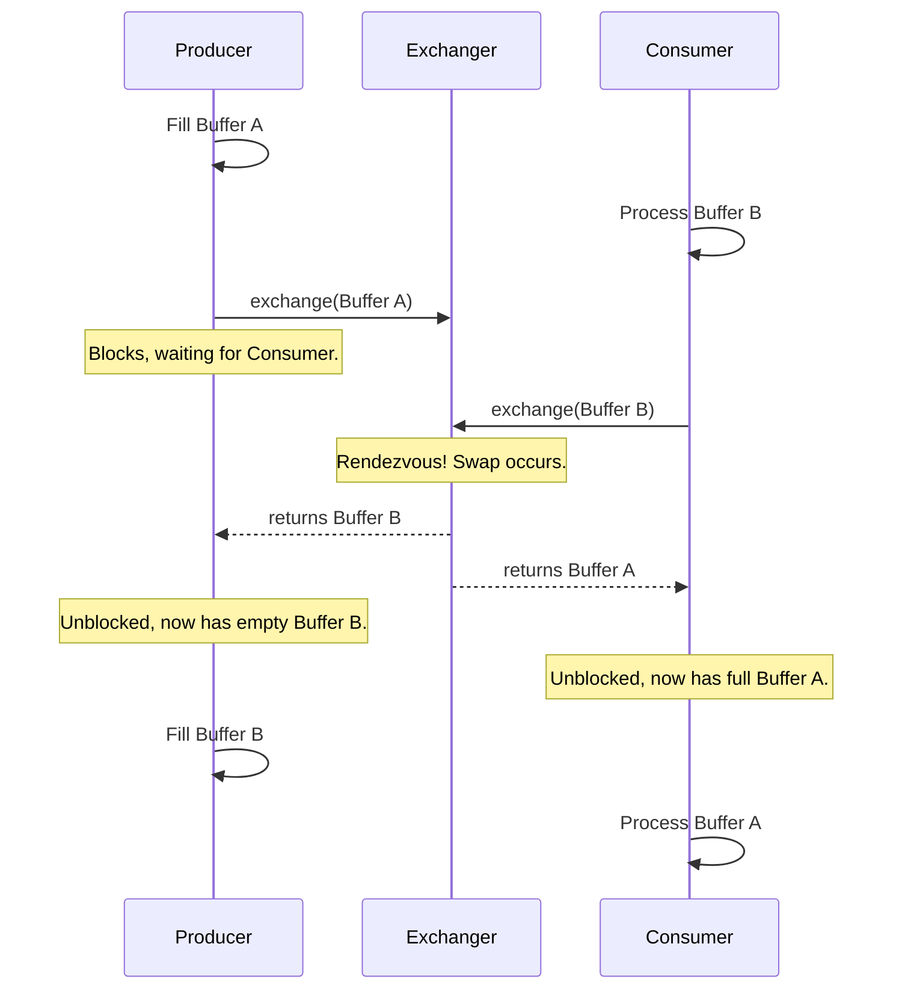

# Module 23: Exchanger - The Rendezvous Point 🤝

## 1. The Problem: How Do Two Threads Swap Data?

Imagine a classic producer-consumer scenario.
*   A **Producer** thread is fetching data from a network and filling up a buffer (like a `List` or a byte array).
*   A **Consumer** thread is taking a full buffer and processing its contents (e.g., writing them to a database).

To work efficiently, they can use **double buffering**. The producer fills `Buffer A` while the consumer processes `Buffer B`. Once the producer has filled `Buffer A` and the consumer has finished with `Buffer B`, they need to **swap**. The producer gets the now-empty `Buffer B` to start filling, and the consumer gets the now-full `Buffer A` to start processing.

**The Historical Problem: Swapping is Awkward**

How would you implement this swap safely?
*   You could use two `BlockingQueue`s (one for full buffers, one for empty buffers). The producer puts a full buffer into one queue and takes an empty one from the other. This works, but it feels heavy and overly complex for a simple two-party swap.
*   You could use a combination of other synchronizers like `CyclicBarrier` and shared state variables, but the logic would be custom, complex, and prone to error.

There wasn't a clean, out-of-the-box utility designed for a simple, two-thread data exchange.

## 2. The Solution: `Exchanger` - A Two-Party Data Swap

Java 5 introduced the `Exchanger`, a simple but powerful synchronizer designed for exactly this problem. An `Exchanger` provides a **rendezvous point** where two, and only two, threads can meet and swap objects.

**How it Works:**
1.  Two threads get a reference to the same `Exchanger` instance.
2.  Thread A calls `V receivedObject = exchanger.exchange(objectFromA)`. This call **blocks**.
3.  Thread B calls `V receivedObject = exchanger.exchange(objectFromB)`. This call also blocks.
4.  When both threads have arrived at the `exchange()` method, the `Exchanger` performs the swap atomically.
5.  Thread A's call unblocks and returns `objectFromB`.
6.  Thread B's call unblocks and returns `objectFromA`.

It's a perfect, synchronized, two-way exchange.

*The diagram shows the producer and consumer swapping buffers, allowing them to continue their work in parallel without interruption.*

---

## 3. When to Use `Exchanger`?

`Exchanger` is a specialized tool, but it's the best in the world for what it does. Use it in any situation that fits the two-party data swap pattern.

*   **Producer-Consumer with Double Buffering:** This is the classic use case. It's highly efficient for streaming data, I/O processing, and similar tasks.
*   **Genetic Algorithms:** In parallel genetic algorithms, different threads might work on different populations of solutions. An `Exchanger` can be used periodically for two threads to swap their best solutions, introducing genetic diversity into each other's populations.
*   **Coordinating Pipelines:** Imagine a multi-stage pipeline. An `Exchanger` can be used as a hand-off point between two stages of the pipeline that are running in different threads.

**Limitations:**
*   **Strictly Two Parties:** It only works for two threads. If a third thread calls `exchange()`, it will just wait forever (or until interrupted/timed out) for a fourth thread that will never arrive.
*   **Blocking:** If one thread arrives at the exchange point but the other is significantly delayed or never arrives, the first thread will be blocked for a long time. There is a version of `exchange()` with a timeout to mitigate this.

For the specific problem of a two-thread rendezvous and swap, `Exchanger` is the cleanest, most expressive, and most efficient tool in the Java concurrency toolbox. 🤝🔄
