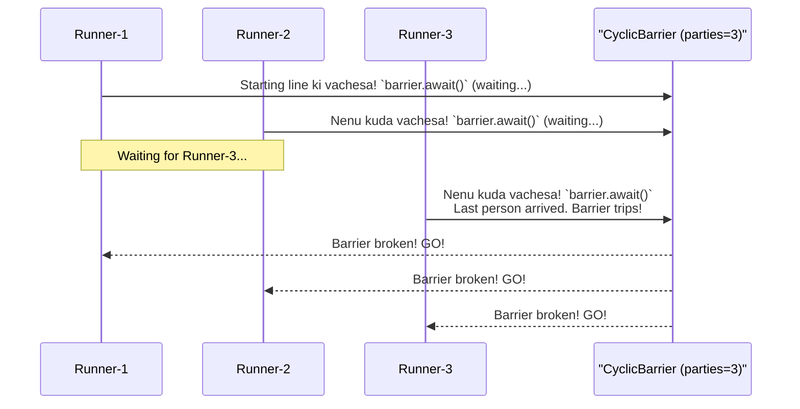

# Stage 2.2: Coordination Primitives - Threads okarito okaru matladukovadam ela?

Manam `synchronized` and `ReentrantLock` use chesi, shared data ni corrupt avvakunda ela kapadalo nerchukunnam. Adi manchi first step. Kani, konni sarlu threads madhya simple locking saripodu. Vaallu okarito okaru matladukovali, coordinate cheskovali.

*   "Nenu ee pani chesanu, ippudu nuvvu start cheyyi."
*   "Andaram ee point ki vachhaka, kalisi munduku veldam."
*   "Buffer lo item ledu, nenu wait chestanu. Item pettagane nannu lepu."

Ilanti coordination kosam Java manaki konni powerful tools (Primitives) ichindi. Let's explore them!

---

### 1. The Classic Trio: `wait()`, `notify()`, and `notifyAll()`

Eevi `java.lang.Object` class lo unna fundamental methods. Ante, prathi Java object ki ee methods untayi.

*   **Main Rule:** Ee methods ni eppudu `synchronized` block or method lopala nunchi matrame pilavali. Ledu ante `IllegalMonitorStateException` vastundi.
*   `wait()`: Ee method ni pilavagane, current thread aa object yokka lock ni release chesi, nidrapotundi (WAITING state). Vere thread `notify()` or `notifyAll()` piliche varaku adi nidra leavadu.
*   `notify()`: Aa object meeda wait chestunna threads lo *oka* (edoka) thread ni leputundi.
*   `notifyAll()`: Aa object meeda wait chestunna *anni* threads ni leputundi.

**The Producer-Consumer Problem:** Idi `wait/notify` ni ardham cheskovadaniki perfect example. Oka thread (Producer) items ni produce chesi oka shared buffer lo peduthundi. Inko thread (Consumer) aa buffer nunchi items ni teeskuntundi.

```mermaid
sequenceDiagram
    participant C as Consumer
    participant P as Producer
    participant B as "Shared Buffer (Lock)"

    C->>+B: Consume cheddam anukuntundi, kani buffer khali ga undi.
    Note over C: Calls `buffer.wait()`. Releases lock & nidra potundi.

    P->>+B: Lock teeskuni, oka item ni produce chesi buffer lo peduthundi.
    Note over P: Calls `buffer.notify()`. Consumer ki signal istundi.
    B-->>P: Producer pani aipoindi.

    C-->>-B: Signal andi, nidra lechindi. Lock malli teeskuni, item ni consume chestundi.
```

---

### 2. `CountDownLatch` - The One-Time Gate

*   **Concept:** Oka "latch" (గడియ) anukondi. Manam daaniki oka initial count istham (Ex: 3). Vere threads `latch.countDown()` ani pilichinappudu aa count okkokkati taggutundi. Ee count zero ayye varaku, `latch.await()` ani pilichina thread wait chestune untundi. Count zero avvagane gate open avuthundi!
*   **Use Case:** Main thread anedi chala services (DB, Cache, Messaging) start ayye varaku wait cheyali anukondi. Prathi service start ayyaka `countDown()` chestundi. Main thread `await()` chestu untundi. Anni services ready avvagane, main thread tana pani continue chestundi.
*   **Important:** Idi one-time use matrame. Latch zero ayyaka reset cheyalem.

```mermaid
graph TD
    subgraph "Services starting in parallel"
        Service1["DB Service (latch.countDown())"]
        Service2["Cache Service (latch.countDown())"]
        Service3["API Service (latch.countDown())"]
    end

    subgraph MainApp ["Main Application Thread"]
        direction LR
        Wait["`latch.await()`<br/>Waiting for count to become 0..."] -- "Count is 0!" --> Proceed["Gate Opened!<br/>All services are UP.<br/>Proceed with application startup."]
    end

    Service1 -- "Done" --> Wait
    Service2 -- "Done" --> Wait
    Service3 -- "Done" --> Wait
```

---

### 3. `CyclicBarrier` - The Reusable Checkpoint

*   **Concept:** "Cyclic" ante reusable. "Barrier" ante addu katta. Andaram kalisi oka point (barrier) ki cherukunnaka, andaram kalisi munduku veldam ane concept idi.
*   Manam barrier ki entha mandi (parties) wait cheyalo cheptam. Antha mandi `barrier.await()` piliche varaku, andaru wait chestaru. Andaru vachaka, barrier break avuthundi, and andaru okesari proceed avutharu.
*   **Use Case:** Oka team of runners (threads) undi anukondi. Andaru starting line ki vachaka okesari race start cheyali.
*   **Important:** Barrier trip ayyaka, daanini malli use cheyochu. Anduke deeni peru "Cyclic" Barrier.



---

### Cliffhanger... Threads ni Manage cheyadam Kashtam ga unda?

Wow! Manam ippudu threads ni coordinate cheyagalam. Superb!

Kani, manam inka `new Thread().start()` ane manual work chestunnam. 1000 threads kavali ante, 1000 sarlu `new Thread()` antama? Ala create cheste system crash avvada? Threads ni reuse cheyadam ela? Oka task nunchi result ni easy ga teeskodam ela?

Ee prashnalu anni chuste, thread management anedi oka pedda pani la anipistondi, kada? Don't worry! Java manaki ee pani ni chala easy cheyadaniki oka wonderful framework ichindi. Get ready to meet the boss of thread management: The **Executor Framework**. Next topic lo, manam threads ni create cheyadam aapi, tasks ni matrame create chesi, vaatini oka "pool" ki submit cheyadam nerchukuntam!
