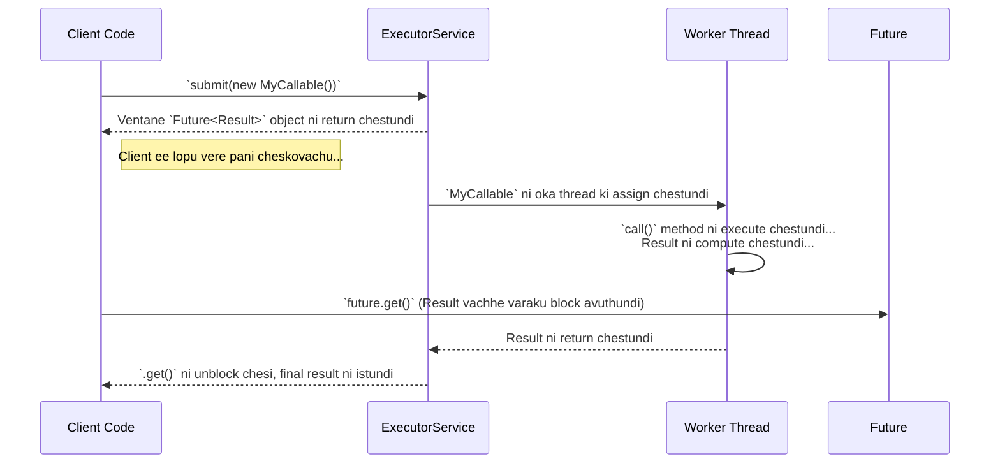

# `Future` and `Callable` - A Deep Dive

Manam `ExecutorService` gurinchi nerchukunnam. Adi tasks ni `Runnable` roopam lo teeskuntundi. Kani `Runnable` tho oka chinna problem undi.

**Limitations of `Runnable`:**
1.  `run()` method emi return cheyadu (`void`). Oka task chesina tarvata oka result kavali ante em cheyali?
2.  `run()` method checked exceptions ni throw cheyaledu. Manam `try-catch` petti handle cheyali.

Ee rendu problems ni solve cheyadanike, Java `Callable` ane inko interface ni introduce chesindi.

---

### `Callable<V>` - The Powerful Task

*   `Callable` anedi `Runnable` laantide, kani rendu super powers unnayi:
    1.  Adi `call()` ane method ni implement chestundi, `run()` ni kaadu.
    2.  Ee `call()` method oka value ni **return** cheyagaladu! Aa value type `V` anedi manam `Callable<V>` lo specify chestam.
    3.  `call()` method checked **exceptions ni throw** cheyagaladu.

```java
// Example: Oka network call chesi, website content ni return chese Callable
Callable<String> fetchWebsiteTask = () -> {
    // Network call logic...
    return "<html>...</html>"; // Returns a String
};
```

---

### `Future<V>` - A Promise for a Future Result

Sare, manam `Callable` ni `ExecutorService` ki submit chesam. Adi oka result ni isthundi. Kani aa task inko thread lo run avuthundi, daaniki time paduthundi. Mari aa result ni manam ela theeskuntam?

Ikkade `Future` vastundi.
*   `executor.submit(myCallable)` anagane, adi manaki ventane oka `Future` object ni return chestundi.
*   Ee `Future` object anedi, future lo raaboye result ki oka **placeholder** or a **promise**.
*   Manam ee `Future` object ni use chesi, task status ni check cheyochu, result vachaka daanini theeskovachu, or task ni cancel kuda cheyochu.

Ee diagram chuste meeku ee process antha ardham avuthundi:



---

### Key Methods of `Future`

*   `V get() throws InterruptedException, ExecutionException`
    *   Idi blocking method. Task poorthi ayyi, result ready ayye varaku aagutundi. Result ready avvagane, daanini return chestundi.
    *   Task lo exception vasthe, `get()` anedi `ExecutionException` ni throw chestundi.
*   `V get(long timeout, TimeUnit unit) throws ...`
    *   Painadani laantide, kani specified time varaku matrame wait chestundi. Aa time loపు result rakapothe, `TimeoutException` throw chestundi.
*   `boolean isDone()`
    *   Task poorthi ayyinda leda ani cheptundi (success, failure, or cancelled).
*   `boolean isCancelled()`
    *   Task cancel cheyabadinda leda ani cheptundi.
*   `boolean cancel(boolean mayInterruptIfRunning)`
    *   Task ni cancel cheyadaniki try chestundi.
    *   `mayInterruptIfRunning` anedi `true` ga set cheste, task already run avuthunte, daanini `interrupt()` cheyadaniki try chestundi.

### Standard Usage Pattern

```java
ExecutorService executor = Executors.newSingleThreadExecutor();

Callable<Integer> task = () -> {
    // Some long computation
    Thread.sleep(2000);
    return 123;
};

Future<Integer> future = executor.submit(task);

System.out.println("Task submit chesam. Future object vachesindi.");
System.out.println("Ee lopu vere pani cheskuntunna...");

try {
    // Ippudu manaki result kavali, so get() tho wait cheddam.
    Integer result = future.get(); // Ekkada block avuthundi
    System.out.println("Result vachesindi: " + result);
} catch (InterruptedException | ExecutionException e) {
    e.printStackTrace();
} finally {
    executor.shutdown();
}
```

`Future` and `Callable` anevi asynchronous programming ki building blocks. Veetini base cheskuni, inka powerful tools vachayi, daani gurinchi manam Stage 3 lo `CompletableFuture` topic lo chuddam!
